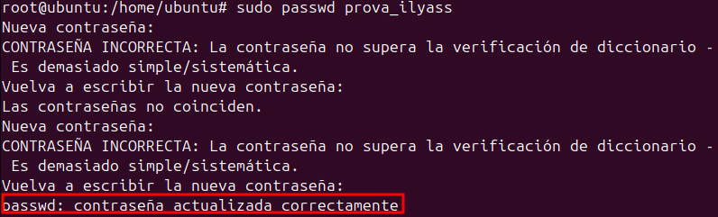
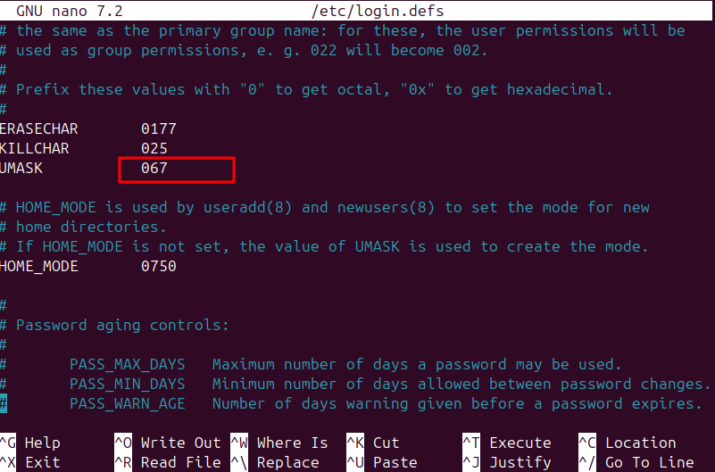
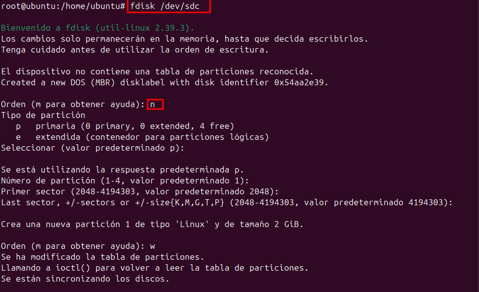
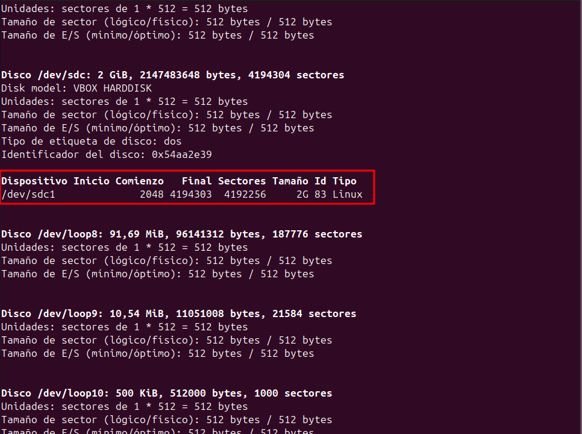
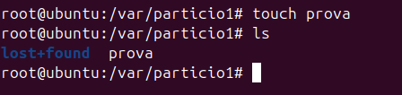
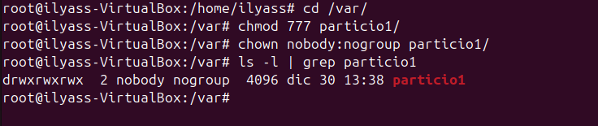
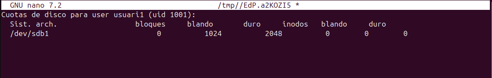
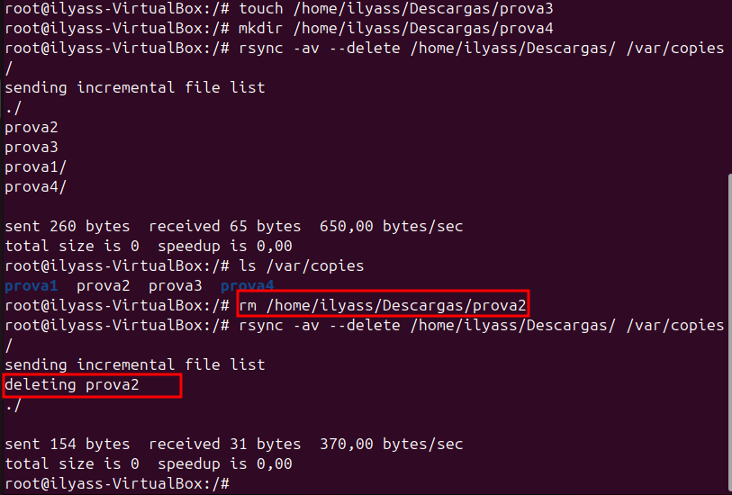
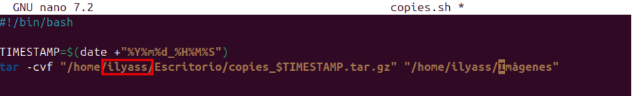

# Sprint 2

## Gestió de processos

### TOP

Aqquesta comanda monitoriotza a temps real tots els procesos que s'executen en el sistema.

### pstree

Mostra una representació en forma d'arbre dels procesoss que se estan executan a temps real.

### ps aux

Es una llista de tots els procesos e s'executen en el sistema a temps real i podem observar que tenen mes informació sobre cada proces.

### Ctrl + C

`Ctrl + C` s'utilitza per parar un proces en el terminal, per exemple si estem fent un ping i cliquem les tecles Ctrl + C detenim el proces.

En aquest cas com no tinc conexió a internet se me ha quedat buscant un ping que no pot trobar i al fer Ctrl + C he interrumpit el proces.

### Ctrl + Z

Es quasi igual al procés anterior, pero en aquest cas es per suspendre el proces i parar-lo temporalment.

### jobs

Aquesta comnada es la que ens enseña tots els procesos que estan segon plà, com en el cas anterior al fer Ctrl + Z , gràcies a esta comanda podem veure quins prpcesos estan parats temporalment.

Aqui podem comprovar amb el procés anterior i també he fet un altre ping i ho he supes temporalment per a que suritgue la llista que la componen dos pings parats temporalment.

### fg %

Esta comanda s'utilitza per tornar a posar en marxa una comanda que està suspesa amb la comanda anterior.
Com abans he fet un jobs i he creat com una llista que la componen 2 ping i ara el que farem es que gracies a esta comanda podrem pasar a primer pla el treball anterior.

### kill -9 PID

Amb aquesta comanda podrem parar un procés amb el seu PID. la comanda seria la següent:

* `kill -9 (PID)`

Ara farem un `ps aux ` per veure tots els processos i seleccionarem un.

Podem observar que el proces 5480 ya no es.

## Gestió d’usuaris i grups

### Fitxers de configuració

Aquest fitxers són importants a tindrels en compte ja que les seues funcions son essencials.

#### **/PASSWD**

El fitxer **/etc/passwd** conté informació bàsica sobre els usuaris del sistema, com els noms dels usuaris, identificadors i altres opcions que fan que el sistema funcioni perfectament.

Aquí podem veure els usuaris i les seves informacions basiques.

Si volem modificar el fitxer utilitzem aquesta comanda:

Llavors ens apereixeria aquest fitxer:

#### **/GROUP**

Es un fitxer de comfiguració essencial que defineix els grups i la seva relació amb els usuaris.S’utilitza per controlar els permisos dels usuaris i l’accés als recursos.Aquí es podria visualitzar els diferents grups amb el seu GID particular.

Per modificar aquest fitxer utilitzem aquesta comanda.

#### **/SHADOW**

Aquest fitxer conté informació encriptada de les contrasenyes dels usuaris i configuracions de seguretat. nomes es pot accedir pel usuari root ja que es protegeixen les contrasenyes. 

Per modificar el fitxer s'utilitza aquesta comanda.

#### **GSAHDOW**

Aquest fitxer és similar al anterior però en aquest cas està fet per a la gestió de grups.

Per modificar aquest fitxer:

#### **/LOGIN.DEFS**

Aquest fitxer proporciona valors predeterminats  a les comandes “useradd” “passwd” i “login” facilitant la configuració per als usuaris.

Per modificar el fitxer:

#### **/DEFAULT/USERADD**

Aquest fitxer conté configuracions predeterminades per a quan es crea un nou usuari amb la comanda useradd.

Per accedir al document es en aquesta comanda.

#### **/ADDUSER.CONF** I  **/DELUSER.CONF**

Són fitxers que controlen el comportament de les eines adduser i deluser. Son molt mes completes que useradd i userdel.

#### **/SKEL**

Aquest fitxer conté una plantilla i directoris predeterminats que se copien directament al directori de **home** dels nous usuaris quan es creen amb la comanda **Useradd**.
Informacio Adicional: Tots aquests arxius que es troben dins de skel, per a poder visualitzar-los tenim que fer un `ls -la`.

Per poder accedir al directori es en aquesta comanda i ja podem observar que estem dins.

Ara que ja estem dins del directori fem un ls -la i observem els arxius que tenim.
 

Poedem observar que tenim 3 documents amb permisos root.

**.profile**: Aquest fitxer s'executa quan el usuari inicia la sessió.S'utilitza principalment per establir configuracions.

Ara que ja hem aprés que realitzen cada un d'aquests arxius podem fer una prova del seu funcionament.

 
 
En el arxiu .profile hem modificat que la carpeta home de l'usuari en vex de crearse en el /home s'ha de crear en el /var.

**.bashrc**:Es carrega a cada sessió, en aquest arxiu es poden definir funcions i varbiales de l'entorn personalitzades.

La modificació que hem realitzat ha segut sobre una comanda, es a dir, que aun fem escribem "connexió" es farà un `ls -la`.

**.Bash_logout**: Aquest fitxer s'executa quan el usuari tanca la sessió. Conté ordres per netejar recursos o finalitzar processos. 

En aquest fitxer he agregat la comanada que he subratllat en la imatge. Aquesta comanada  elimina tots els arxius dins del directori "Baixades" del usuri actual quan es tanca la sessió . **S'executa quan la sessió se tanca.**  

### Administració d'Usuaris
### Agregar usuaris

#### **useradd**

* Comando básico de gestión de usuarios en sistemas Linux
* No realiza configuraciones automáticas ni pasos adicionales.
* Al usar useradd, es necesario especificar manualmente:
    * El directorio home.
    * Los grupos.
    * La shell.
    * Otras configuraciones, si no se desean los valores predeterminados.
* Ideal para usuarios avanzados que necesitan personalizar todos los aspectos de las cuentas de usuario.

Ara le afegim una contrasenya al usuari.

Seguidament le afegim una Shell.

Finalment comprovem que hem cambiat la contrasenya i la shell. 
Per verificar que si hem creat el usuari utilitzem el fitxers que he expplicat abans i també en la interficie gràfica.

#### **adduser** 

- És un script en Perl que fa servir internament `useradd`.
- Ofereix una interfície més senzilla i configura automàticament diversos paràmetres per defecte:
    - Crea el directori `home` de manera automàtica.
    - Assigna un grup per defecte.
    - Demana una contrasenya durant el procés.
- **Més fàcil i pràctic** per a usuaris que volen crear comptes sense haver de definir cada paràmetre manualment.

Prova:
Podem veure que ens demana contrasenya i que ens crea el directori home de forma automatica i ens assigna a un grup per defecte

Aqui podem comprovar que estan tot creat i que no fa falta que el creem nosaltes.

### Eliminar Usuaris

Per eliminar un usuari utilizem la comanda`deluser (nom usuari)`
#### **Deluser**

Al fer aquesta comanda, nomes eliminem el usuari pero deixem els arxius del usuari i altres.

Per eliminar un usuari es en aquesta comanda.

Comprovem que s’ha borrat, podem observar que ja no es veu el l'usuari.

Per borrar els arxius necessitem fer altres comandes.

Per eliminar també el seu directori hem de fer la comanda `deluser --remove-home (nom usuari)` 

### Agregar i eliminar grups

#### **Groupadd**

Creem el grup classe i verifiquem que esta en el fitxer /etc/group.

Per afegir un usuari a un grup hem de fer aquesta comanda. 
`usermod -aG nom_grup nom_usuari`

Ara per eliminar el usuari del grup, utilitxem aquesta comanda:
`gpasswd -d nom_usuari nom_grup`

#### **Delgroup**

Ara eliminem el grup i verifiquem si esta borrat.

Aqui podem veure que el grup classe ja no existeix.

### Personalització d'usuaris
Ara ja que tenim una mica de idea sobre creació d'usuaris, anirem a modificar les comandes `adduser` `useradd`
En primer lloc modificarem la comanda **adduser**

Hem modificat aquestes punts:
* DHOME=/home a DHOME=/tmp: les carpetes "home" no es crearan en la carpeta home sino que en "/tmp"
* #SKEL=/etc/skel a SKEL=/etc/skel: es a dir hem llevat el hastag de comanetari ja que no he feia efecte.
* FIRT_UID=1000 a FIRT_UID=2000: aqui cambiem el numero per defecte del usuari a 2000.
* FIRST_GID=1000 a FIRST_GID=2000: Es la mateixa que la anterior pero en aquest cas es sobre grups.
Ara comprovem el canvis.

Finalment per acabar amb aquest apartat nem a modificar la comanda **useradd**
En aquest arxiu no fa falta cambiar parametres ja que com hem de fer nosaltres el canvis manualment.

## Gestió de permisos
En primer lloc, es impresendible saberse com es la taula de persmisos en forma binaria: 

En primer lloc creem 4 usuaris (verd,groc,roig,blau) i un grup(parchis), afegim verd i blau al grup parchis i l'usuari groc al grup sudo.

Aqui podem visualitzar els permisos dels usuaris que hem creat.

### Pemisos normlas

**chgrp**

En primer lloc crearem una carpeta proves i dins tambe crearem un arxiu "hola" dins del usuari "groc"

Ara cambiarem els permisos a la carpeta proves, es a dir, modificarem els permisos posant-la en el grup parchis. 

Aquesta comanda 
`chgrp -R parchis proves/` en aquest cas, la comanda mou tot el que es troba dins de la carpeta al mateix destí.

**chmod**

En aquest cas canbien els permisos al grup i usuaris.
`chmod -R proves`: en aquesta imatge podem observar els canvis que hem realitzat.

**Comprovacions dels permisos donats**

**Usuari Groc(sudo)**

En la següent imatge podem comprovar que podem fer un ls -l i tambe podem accedir dins de la carpeta.

**Usuari Verd i blau**

En aquests 2  usuaris com estan al mateix grup tenen els mateixos permisos i  podem accedir dins de la carpeta pero no podem crear cap arxiu ni borrar.

**Usuari Roig**

En aquest cas no podem accedir ni a la carpeta.

### Permisos Especials

En aquest punt, volem crear una carpeta i que els diferents usuaris puguin fer determinades funcions amb els permisos que s'els  otorga a cadascú

**Sticky**
Donar uns deteminats permisos com poden llegir,  crear i tot pero no poden borra els fitxers dels altres només els seus.

**Comprovaciopns**

**Roig**
Crearem dos arxius dins de la carpeta i borrarem un i podem observar que si que el podem borrar i deixarem el altre per comprovar si el podem borrar en altres usuaris.

**Verd**

Ara comprovem el usuari verd. I podem observar que podem crear pero no podem borrar.

**getfacl**

Aquesta comanda permet veure coses extra sobre la carpeta sabre els seus permisos.

**setfacl**

Aquesta comanmda ens permet fer exepcions.Tenim diferenets parametres.

**-m**

Aqui podem comprovar que hem fet la exepció.

**-b**

Serveix per eliminar tootes les exepcions.

**-x**

Elimina les exepcions sobre un usuari en concret.

### Permisos UMASK

**Què és la mascara de permisos?**

La màscara de permisos (Umask) és un valor que defineix quins permisos es retiraran per defecte quan es creen nous fitxers o directoris.Això assegura que els fitxers no tinguin permisos massa amplis.

Per saber quina mascara tenim fem aquesta comanda:

**Funcionament de la Màscara**

La màscara de permisos (umask) defineix quins permisos es retiren per defecte quan es crea un nou fitxer o directori. Això es fa mitjançant una operació lògica AND entre els permisos predeterminats i la màscara negada.

Permisos predeterminats
* Fitxers: 666 (lectura i escriptura per a tots els usuaris).
* Directoris: 777 (lectura, escriptura i execució per a tots els usuaris).

Fem la operació AND per a donar permisos a un usuari per un directori.

En surt el numero que hem de assignar.

**Canvair UMASK**

Per canviar tenim dos formes; temporal i difinitiva.

**Temporal**

S'utilitza aquesta comanda:

**Difinitiva**

Per cambiar de forma difinitiva ho hem de fer en el fitxer **/etc/login.defs**

**Comprovació**

Ara crearem un nou usuari per comprovar la modificació i podem veure que se ha modificat correctament.

Per finalitzar Umask és util per establir permisos predeterminats de manera temporal o permanent.

## Sistemes de fitxers i particions
**Estructura de la informació**

**mida sector**

Unitat mínima fisica on es guarden le sdades i la minima es 512 bytes pero el sistema no treballa en  sectors, treballa en blocs. la mida del sector no es pot cambiar ja que ve predefinida desde fabrica

**mida block**

Es la unitat lògica del sistema operatiu on es guarden les dades per defecte. La mida block es pot canviar quan formatem la mida sector. 

**fragmentacio interna**

Quan és tot aquell espai desaprofitat dels blocs que no s'acaben de plenar.
Es pot disminuir la mida del bloc pero tindrem el problema de baixada del rendiment.
També es una bona solució que es aumentar el tamany del blocs pero empitjorem la fragmentació interna molt.

**frammentació externa**

La fragmentació externa és un problema que es produeix a la memòria quan l'assignador deixa seccions de blocs de memòria no utilitzats entre parts de la memòria assignada.

Un bloc fragmentat externament encara està disponible per a l'assignador, però només si es necessita memòria que pugui cabre dins d'aquest bloc. El bloc aïllat no es pot utilitzar per a necessitats de memòria més grans i no es pot reagrupar amb la memòria lliure total.

**Solució**

La solució principal per reduir la fragmentació externa és la desfragmentació, que reorganitza els blocs de memòria per agrupar l'espai lliure i fer-lo més útil per a futures assignacions.

**Creació de particions i formats**

**Tipus de formateig**

* **Baix Nivell**

* Es realitza a nivell físic del disc.
* Divideix el disc en sectors i pistes que poden ser reconeguts pel maquinari.
* És un procés que es fa en fàbrica i rarament es necessita fer manualment.

* **Rapid Nivell**

* Esborra només la taula d'assignació de fitxers (FAT) o l'índex del sistema de fitxers.
* Les dades encara existeixen físicament al disc, però ja no són accessibles fàcilment.
* És molt més ràpid que el formateig complet.

* **Mig nivell**

* Defineix el sistema de fitxers que s'utilitzarà a la partició .
* Configura la partició per emmagatzemar dades segons el sistema operatiu i el tipus d'ús.

**Sistemes de fitxers**

**Creació de particions i formateig**

Els sistemes de fitxers són els encarregats d’organitzar i gestionar les dades.

Creem un disc:

Fem aquesta comanda `fdisk -l` aixi podem visualitzar tota la informació.

Ara que ja saben que el disc en el que volem treballar es **sdc** nem a accedir a ell.

 `fdisk /dev/sdc ` amb aquesta comanda podem accedir al disk especificat.
 Poseu la lletra n per realitzar la partició, i procedim a clicar enter ja que volem tot predeterminat.

I per a comprovar que hem una partició, tornem a realitzar la comanda  `fdisk -l`.

Ara procedim a fer el formateig de la partició i modifiquem el tamany del bloc.

Podem observar que hem fet el canvi correctament del bloc i el formateig.

### Muntatge de les particions**

#### **Temporal**

Les particions temporals s'utilitzen per dividir un espai de manera provisional i poden ser desmuntades fàcilment. 

Per a realitzar muntatges temporals es important fer aquests pasos.

En primer lloc, entrem al directori /var i creem una crapeta particio1 i 

Dins de la carpeta creem un arxiu .txt. Realitzem aquesta comanda `mount -t ext4 /dev/sdc1 /var/particio1` i al fer un `ls` podem comprovar el que hem fet. I per desmuntar fem la comanda `umount -t ext4 /dev/sdc1 /var/particio1` i ja estaria desmontat.

Creem un añtre fitxer per a un futur.

Fem un `reboot`(en la captura esta mal posat) i al reiniciar podem comprovar que ja no el trobem ja que es **temporal**.

#### **Difinitiu**

Per realitxar el muntatge Difinitiu hem de modificar el arxiu /etc/fstab amb les següents modificacions.

Ara al fer un `reboot` encara tenim el muntatge fet ja que aquesta es la forma difinitiva.

Aqui podem comprobar que els canvis se han realitzat correctament.

### **comparticio de la carpeta en Xarxa.**

Tenim diferents formes per a compartir fitxers en la mateixa xaraxa, Nosaltres hem provar **Nautilus** **samba**

#### **Nautilus**

En primer lloc, instal·larem Nautilus amb la següent comanda.

Ara entrem a la carpera /var/ i fem clic dret a la carepta que hem creat i posem a la opció de "opcions de comparticio"

Podem observar que amb aquesta forma no ens funiona, per això utilitzarem la opció de **Samba**

#### **Samba**

Com que la opció anterior no ens ha funcionat, provarem aquseta per si ens funciona...

Intsallem SAMBA amb la comanda següent.(Virtual Box) Cal recalcar que es possible que ya estigue instal·lada.

Modifiquem el següent arxiu `/etc/samba/smb.conf`

Fem la següent comanda per Reiniciar el servei que gestiona la comparticiode fitxers i autinticació d'usuaris(smbd) i per reinicia el servei que gestiona el servei de noms i la descoberta de recursos en la xarxa(nmbd).

Cambiem els persmisos per que tots els usuaris puguin tenir les mateioxes opcions sobre la carpeta, amb la següent comanda.

Creem el ususari que hem posat anteriorment al modificar el arxiu `/etc/samba/smb.conf` per a no tenir problemes proximament.

Utilitzem la següent comanda per a que altres usuaris puiguin accedir als recursos compartits configurats a traves de SAMBA.

En el meu cas he posat (Adaptador pont) pero no me ha funcionat i he posat (Adaptador nomes d'amfitrio) i he provat la conexió i me ha funionat.

Cambiem a l'opció Usuari registrat i posem el nom d'usuari i la seva contraseña i ja ens connectat.

Creem una carpeta o arxiu, que en aquest es una carpeta, per provar la connexió.

Ara nem a la VM i entrem a la carpeta i fem un `ls -l` per veure les propietats i podem veure que el que la ha creat es l'usuari platano.

#### **Creació de Particions i Formatació en NFTS: Guia per Ubuntu i Windows**

En aquest cas farem l'exercici adicional que es compartir un directori formatat amb NTFS.**Cal aclarir que no he pogut solucionar els errors que me ha donat**

Creem i muntem un directori

Creem un directori que volem que apareixe en el dispositiu windows.

Cambiem el fitxer`/etc/fstab` amb les següents dades.

Seguidament modifiquem `/etc/samba/smb.conf`

També cambiem els permisos per a que tots tinguen els mateixos permisos i tambe reseteigem el smbd i nmbd.

**Finalment al voler fer la connexió per a conectarme en el sistema operatiu windows hem dona el problema de error de connexió**

## Còpies de seguretat i automatització de tasques
## quotes de disc

### Que són les quotes de disc?

Les quotes de disc són un mecanisme utilitzat en sistemes operatius per controlar i limitar l'espai d'emmagatzematge que un usuari o grup pot utilitzar en un sistema de fitxers. Això és especialment útil en entorns multiusuari, com ara servidors o sistemes compartits, per evitar que un usuari ocupi tot l'espai disponible al disc dur i afecti altres usuaris o el rendiment general del sistema.

### Com funcionen les quotes de disc?

Les quotes es configuren per usuari o grup en un sistema de fitxers específic.
Els administradors poden establir:
* Límits per fitxers: Nombre màxim de fitxers que un usuari pot crear (també conegut com a límit d'inodes).
* Límits per espai: Quantitat màxima d'espai que pot utilitzar un usuari en megabytes (MB), gigabytes (GB), etc.
Les quotes es controlen mitjançant eines del sistema operatiu, com ara:
* quota o edquota en Linux.
* Funcions integrades en Windows Server.

### Exercici practic 

En primer lloc, Intsal·lem "quota".

Creem una nova particio amb la comanda `fdisk /dev/sdc` i prenem la tecla n per crear la partició. Al fer la comanada `fdisk -l` podem verificar que hem fet la partició.

Modifiquem el arxiu **/etc/fstab** i posem els següents parametres:

* defaults, usrquota i grpquota: per a que habiliti les quotes per a usuaris i grups. 

Com ja sabem, al modificar aquest arxiu, hem de reiniciar.

**Important: Si modifiquem mal el arxiu no podrem reiniciar el sistema i ho hem de arreglar manual**

En segon lloc, activem les quotes en un directori amb les següents comandes`quotacheck -cug /mnt/dades` i despres `quotaon /mnt/dades` i ho verifiquem aml la comanda `ls -la`

En el meu cas, es important fer aquestos pasos sinò, no es podra fer el munstatge. es fer un formateig amb el format **ext4** i despres fer un muntatge com hem fet abans.

Crem l'usuari per poder fer proves.

Nem a la carpeta /mnt/ i realitxem aquesta comanda`edquota -u usuari1`per editar manualment les quotes assignades a un usuari. Nosaltres modificarem aquests dos parametres.

* blando: indica el limit que l'usuari pot exedir durant el periode.
* duro: Es el límit maxim que no pot exedir l'usuari.

Es important cambiar el persmisos del directori, per a poder crear arxius desde altres usuaris.

**Ara intentarem sobrepasar el limit del que hem modificat en el arxiu de `edquota -u usuari1`**

Amb la següent comanda `dd if=/dev/zero of=test bs=1K count=800` creem arxius amb un fitxer d'entrada que en aquest cas es /dev/zero, que genera zeros contínuament. També hem especificat el nom del arxiu i finalment diem quina mida volem que tingue l'arxiu que sera de uns 800Kb.

Podem observar que hem creat 3 fitxers correctament, però, al ultim fitxer he tingut l'error que voliem que es que hem sobrepassat el limit d'espai.

Ara ja sabem quin es el límit, borrem els 4 arxius creats i nem a fer-ho de forma grafica descargant imatges amb bona resolució.
He descargat una imatge amb una mida de 887 Kb i he provat de sobrepassar el limit.

He ho he trobat ja que he deixat dos arxius anteriors per a fer espai. He calculat que no podre ni desà cap imatge i sí, tinc raó, ja que he sobrepassat el límit del directori. 

## Còpies de seguretat i automatització de tasques

### 1.Teoria
#### 1.1Còpies de seguretat (fer una taula comparativa)

| **Tipus**           | **Descripció**                          | **Avantatges**                                         | **Desavantatges**                                           |
|----------------------|------------------------------------------|-------------------------------------------------------|-------------------------------------------------------------|
| **Completes**        | És realitza una copia de tot.           | No es deixa cap arxiu,es a dir, es fa una copia de tot.              | Al fer estes copies completes utilitza molt d'espai i tarda molt de temps per fer les copies ja que en fa de tot.                |
| **Diferencials**     | Una diferencial copia la diferencia sempre a partir de la ultima completa  | És molt útil per a copies que es fan seqüentcialment ja que utiliza menys espai i tarda menys que una completa.    | Necessita l'última completa i l'última diferencial (ja que fa com una diferencia entre la completa i la ultima diferencial).         |
| **Incrementals**     | Canvis des de l'última còpia (qualsevol).| ocupen menys espai i son molt més ràpides.| Necessita completa i totes les incrementals per restaurar.  Duplicity

### 2.Comandes
#### 3.1 Explicació
#### 3.2cp
Es una copia simple no intel·ligent ho copio tot sense mirar res, ho fa tot en el local i no es pot fer remotament.

#### 3.3rsync
Copia intelligent només copia fitxers modificats i se pot utilitzar entre màquines remotes per ssh.

#### 3.4dd
No és per a fer còpies de fitxers és més per a fer clonacions de particions o de discos.També treballa en local i ho copia tot és a dir que tampoc és intel·ligent.
Serveix per sobreescriu dades de sector a sector.Ja que ho esborra tot a nivell de bloc

#### **CP(pràctica)**

La comanda es cp -r /(origin) /(Destí). 
Podem observar que hem fet una copia de tot lo que es troba al directori /homw/ilyass/Descargas a la carpeta nova que hem creat.

#### **rsync**

Aquesta comanda el que fe es una copia exacta dels directoris, es a dir, borra fitxers que no es triben en el altre directori.

rsync -av --delete /home/alumne/Descargas/ /var/copies/

Podem observar que ens borra la carpeta de prova 2 ja que no es troba en /var/copies.

### **Automatització amb scripts i cron i anacron( Automatització de tasques a partir scripts)** 

#### Diferencies entre anacron i cron

Serveixen per automatitzar tasques en Ubuntu. Anteriorment funcionaven per separat, però ara estan integrats tots dos junts.

Si els ordinadors poden estar apagats, és millor utilitzar anacron, perquè cron executa només quan l'ordinador està encès. En canvi, anacron automatitza tasques quan l'ordinador està apagat, i quan s'encén revisa si té alguna tasca pendent i l'executa.

Utilitzarem anacron per a tasques de manteniment i generals.

En canvi, utilitzarem cron quan ens interessa executar una funció en una data exacta o per a un usuari específic.

Utilitzarem el fitxer /etc/crontab quan vulguem programar alguna cosa global per a tots els usuaris.

Quan ens interessi un usuari específic, executarem la comanda crontab -e -u(usuari).

Dins del directori /etc hi ha unes carpetes predeterminades per al cron, on podem posar scripts que es vulguin executar en una data exacta.

#### **Pràctica**
Creem un script per podeer provar com funciona aquesta pràctica i posem el codi següent.
Si posem /home/$USER en anacron no funciona i hem de posar el usuari especific.

Cambiem els permisos a root.

En el arxiu /etc/crontab posem que en en la fecha següent es faigue la clonació del directori "imágines"

Aqui podem observar que ens ha fet la clonació en el la hora 10:26.

Ara el que farem es borrar la data d'avui en el fitxer /etc/cron.daily. 
En primer lloc passem la script copies.sh

Ara borrem el .sh per a no tenir confusions.

Borrem el que hi ha dins de cron.daily

Cambiem de 5 a 1 per a que nomes tarde 1 min per a que ens pose la fecha en el cron.daily

Esperem el minut i ja podem veure que ja tenim la fecha diaria.
