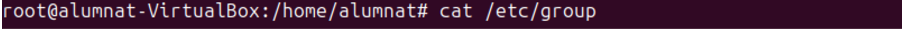
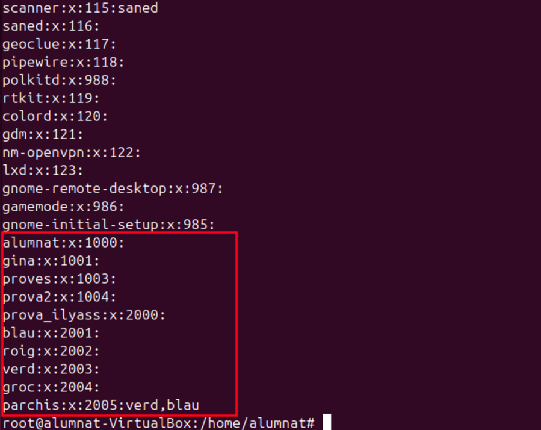
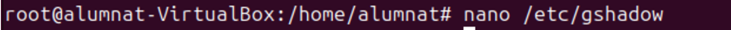
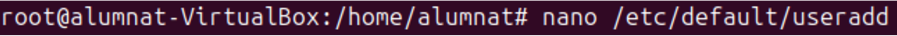
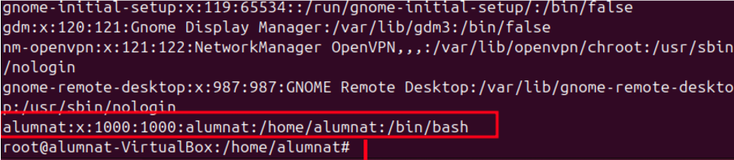

# Sprint 2

## Gestió de processos

## Gestió d’usuaris i grups

### Fitxers de configuració

Aquest fitxers són importants a tindrels en compte ja que les seues funcions son essencials.

**/etc/passwd**

El fitxer **/etc/passwd** conté informació bàsica sobre els usuaris del sistema, com els noms dels usuaris, identificadors i altres opcions que fan que el sistema funcioni perfectament.

Aquí podem veure els usuaris i les seves informacions basiques.

Si volem modificar el fitxer utilitzem aquesta comanda:

Llavors ens apereixeria aquest fitxer:

**/etc/group**

Es un fitxer de comfiguració essencial que defineix els grups i la seva relació amb els usuaris.S’utilitza per controlar els permisos dels usuaris i l’accés als recursos.Aquí es podria visualitzar els diferents grups amb el seu GID particular.

Per modificar aquest fitxer utilitzem aquesta comanda.

**/etc/shadow**

Aquest fitxer conté informació encriptada de les contrasenyes dels usuaris i configuracions de seguretat. nomes es pot accedir pel usuari root ja que es protegeixen les contrasenyes. 

Per modificar el fitxer s'utilitza aquesta comanda.

**/etc/gshadow**

Aquest fitxer és similar al anterior però en aquest cas està fet per a la gestió de grups.

Per modificar aquest fitxer:

**/etc/login.defs**

Aquest fitxer proporciona valors predeterminats  a les comandes “useradd” “passwd” i “login” facilitant la configuració per als usuaris.

Per modificar el fitxer:

**/etc/default/useradd**

Aquest fitxer conté configuracions predeterminades per a quan es crea un nou usuari amb la comanda useradd.

Per accedir al document es en aquesta comanda.

**/etc/adduser.conf i /etc/deluser.conf**

Són fitxers que controlen el comportament de les eines adduser i deluser. Son molt mes completes que useradd i userdel.

**/etc/Skel**

Aquest fitxer conté una plantilla i directoris predeterminats que se copien directament al directori de **home** dels nous usuaris quan es creen amb la comanda **Useradd**.

Per poder accedir al directori es en aquesta comanda i ja podem observar que estem dins.

Ara que ja estem dins del directori fem un ls -la i observem els arxius que tenim.
 

Poedem observar que tenim 3 documents amb permisos root.

**.Bash_logout**: Aquest fitxer s'executa quan el usuari tanca la sessió. Coné ordres per netejar recursos o finalitzar processos. 

**.bashrc**:Es carrega a cada sessió, en aquest arxiu es poden definir funcions i varbiales de l'entorn personalitzades.

**.profile**: Aquest fitxer s'executa quan el usuari inicia la sessió.S'utilitza principalment per establir configuracions.

Ara que ja hem aprés que realitzen cada un d'aquests arxius podem fer una prova del seu funcionament.

 
 
En el arxiu .profile hem modificat que la carpeta home de l'usuari en vex de crearse en el /home s'ha de crear en el /var.

La modificació que hem realitzat ha segut sobre una comanda, es a dir, que aun fem escribem "connexió" es farà un ls -la.

En aquest fitxer he agregat la comanada que he subratllat en la imatge. Aquesta comanada ens vol que elimina tots els arxius dins del directori "Baixades" del usuri actual. S'executa quan la sessió se tanca.  

**UserAdd**

Per crear usuaris s'utilitza aquesta comanada.
Aquesta comanda es la més bàsica, principalment fes de les herramentes de gestío d'usuaris.

Per verificar que si hem creat el usuari utilitzem el fitxers que he expplicat abans.

**adduser** 

Aqeusta comanda realitza varies configuracions, ja que es molt mes cmpleta que la comanada anterior.

**Deluser**

Per eliminar un usuari es en aquesta comanda.

Comprovem que s’ha borrat, podem observar que ja no es veu el l'usuari.

**Groupadd**

Creem el grup classe i verifiquem que esta en el fitxer /etc/group.

**Delgroup**

Ara eliminem el grup i verifiquem si esta borrat.

## Gestió de permisos

## Sistemes de fitxers i particions

## Còpies de seguretat i automatització de tasques

## Quotes de disc
